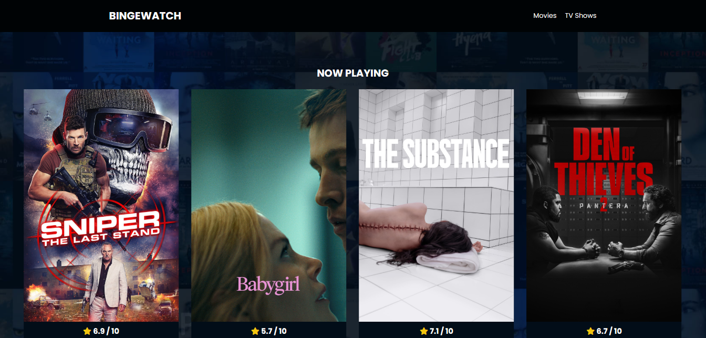
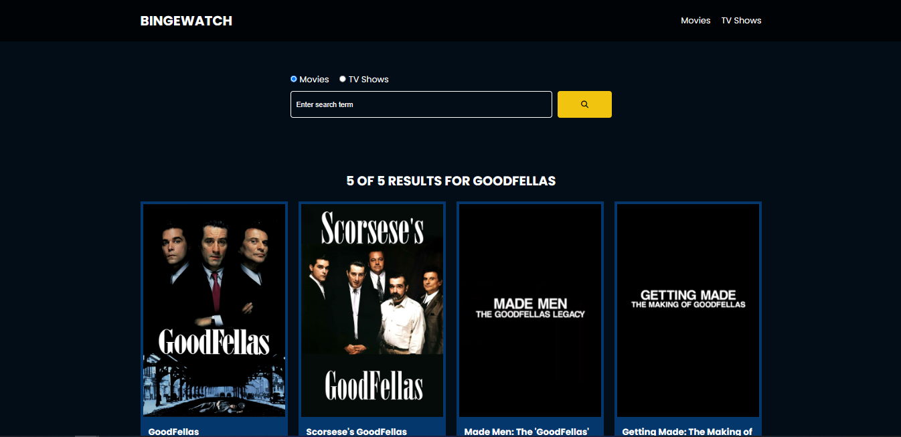

# Movie and TV Shows details Web App (VANILLA JS)

solely for educational purposes

## Concepts learned:

this project incorporates several basic vanilla js concepts:

-   DOM Manipulation
-   Events
-   Routing (lil bit)
-   Async JS
    -   fetchAPI
    -   Async / Await

## Pages

main page

search page (term: Goodfellas)

## Credits

-   HTML and CSS Template: [youtube.com/@TraversyMedia](https://www.youtube.com/channel/UC29ju8bIPH5as8OGnQzwJyA)
-   API: [themoviedb](https://www.themoviedb.org/)
